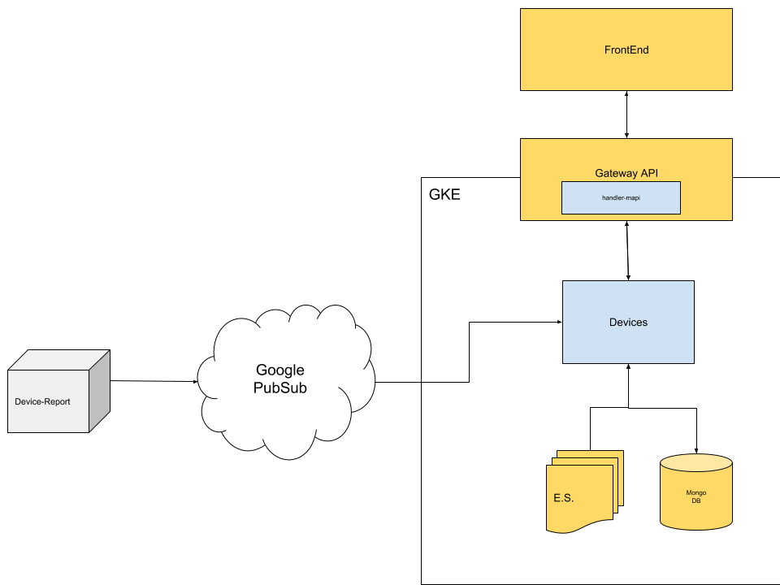
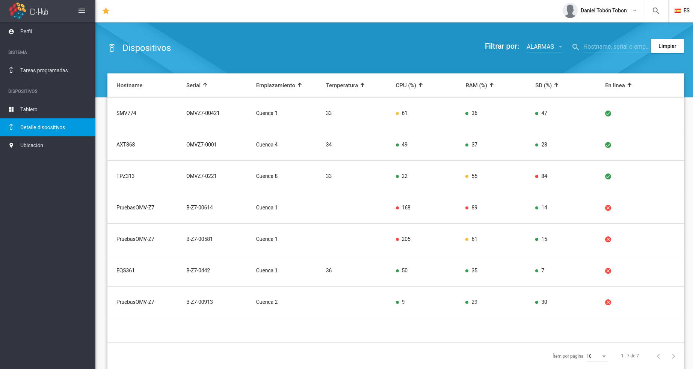
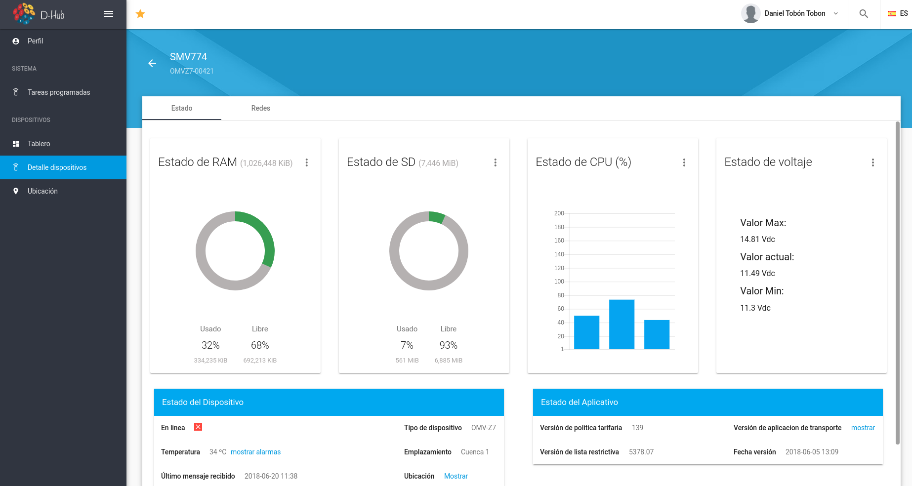
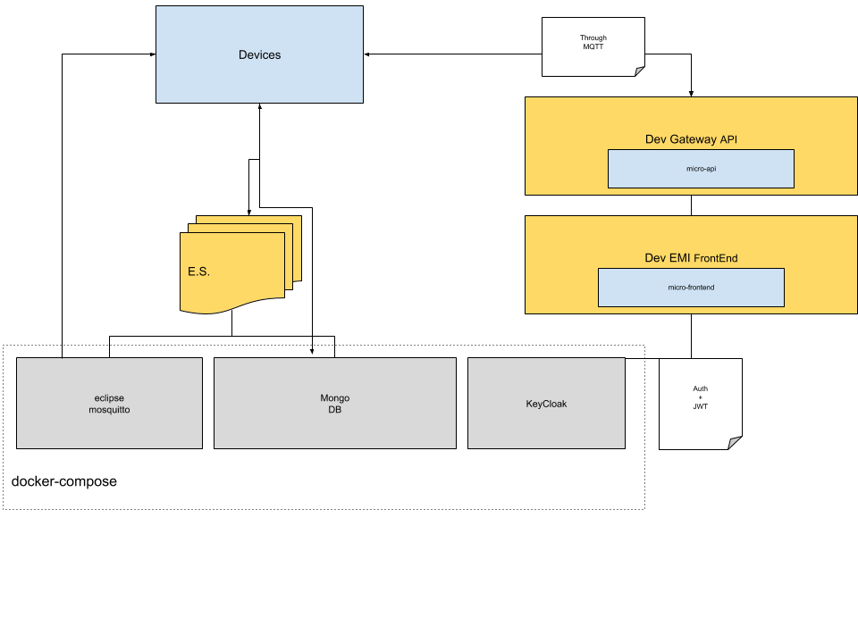

# Devices MicroService
The general purpose of this service is to listen, store and show the general information of devices reported by the microservice [ms-device-report](https://github.com/nebulae-tpm/ms-devices-report).
This process is handle by three subprocess:
 * device backend: listen to incoming reports from [ms-device-report](https://github.com/nebulae-tpm/ms-devices-report) throught the [PubSub](https://cloud.google.com/pubsub/docs/apis) Topic, then format and store the data in the materialized view then then publish this data to device api.  
 * device api: this service is a bridge between the backend and the frontend, this api use the [Apollo Graphql api](https://www.apollographql.com/docs/apollo-server/), here is hosted the Queries and the subscribtions consumed by the frontend.

 * device frontend: show the stored info of devices using a client-side aplication based on 
 [Angular core](https://angular.io/) as the basis of the project and [Angular material](https://material.angular.io/) as a visual framework. 

 _This MicroService is built on top of NebulaE MicroService Framework.  Please see the [FrameWork project](https://github.com/NebulaEngineering/nebulae) to understand the full concept_**.

 

 # Table of Contents
  * [Project Structure](#structure)
  * [FrontEnd](#frontend) 
    *  [Environment variables](#frontend_env_vars) - not yet available  
  * [API](#api)
    * [GraphQL throught Gateway API](#api_gateway_graphql)
  * [BackEnd](#backend)
    *  [Devices](#backend_devices)
        *  [Environment variables](#backend_devices_env_vars)
        *  [CronJobs](#backend_handler_cronjobs)
        *  [Event Sourcing](#backend_devices_eventsourcing)    
  * [Prepare development environment](#prepare_dev_env)
  * [License](#license)

# Project structure <a name="structure"></a>

```
.
├── frontend                            => Micro-FrontEnds - not yet available  
│   └── emi                             => Micro-FrontEnd for [EMI FrontEnd](https://github.com/nebulae-tpm/emi) - not yet available  
├── api                                 => Micro-APIs  
│   └── gateway                         => Micro-API for [Gateway API](https://github.com/nebulae-tpm/gateway)  
├── backend                             => Micro-BackEnds  
│   ├── devices                         => Micro-BackEnd responsible for store and publish device info incomming from ms-device-report 
├── etc                                 => Micro-Service config Files.  
├── deployment                          => Automatic deployment strategies  
│   ├── compose                         => Docker-Compose environment for local development  
│   └── gke                             => Google Kubernetes Engine deployment file descriptors  
│   └── mapi-setup.json                 => Micro-API setup file  
├── .circleci                           => CircleCI v2. config directory
│   ├── config.yml
│   └── scripts
├── docs                                => Documentation resources  
│   └── images  
├── README.md                           => This doc
```

# Frontend <a name="frontend"></a>

In this section you can find the information (Alarms, current status, histograms) reported by the devices that are currently registered in the platform. This section is divided into two views:

- the list of devices (see image bellow) where all the devices that are registered on the platform are displayed, in this table you can see general data such as the serial number, RAM status, CPU, SD and if it is active. Also, for ease of use to this list you can apply search filters by means of alarms (CPU, RAM, SD and Temperature) and a search box that looks for matches with the hostname, serial or location.



- Can be accessed by selecting an item in the list of devices (see image above), in this section you can view the current status of the devices




# API <a name="api"></a>
Exposed interfaces to send Commands and Queries by the CQRS principles.  
The MicroService exposes its interfaces as Micro-APIs that are nested on the general API. 

## GraphQL throught Gateway API <a name="api_gateway_graphql"></a>
These are the exposed GraphQL functions throught the [Gateway API](https://github.com/nebulae-tpm/gateway). 

Note: You may find the GraphQL schema [here](api/gateway/graphql/devices/schema.gql)

### Queries

#### getDeviceDetail
Get device detail filtered by the device id

#### getDevices
Get a list of devices limited by page and count and filtered by a filter Template

#### getDeviceTableSize
Get the size of table Device

#### getAlarmTableSize
Get the size of table Alarms

#### getDeviceAlarms
Get a list of device alarms limited by page and count and filtered by device id, alarmType, initTime and endTime

#### getRamAvgInRangeOfTime
Get the device RAM history 

#### getRamAvgInRangeOfTime
Get the device SD history 

#### getRamAvgInRangeOfTime
Get the device CPU history 

#### getRamAvgInRangeOfTime
Get the device VOLTAGE history 

### Subscriptions

#### DeviceVolumesStateReportedEvent
Listen the changes when ms-device-report send DeviceVolumesStateReported

#### DeviceDisplayStateReportedEvent
Listen the changes when ms-device-report send DeviceDisplayStateReported

#### DeviceSystemStateReportedEvent
Listen the changes when ms-device-report send DeviceSystemStateReported

#### DeviceDeviceStateReportedEvent
Listen the changes when ms-device-report send DeviceDeviceStateReported

#### DeviceLowestVoltageReportedEvent
Listen the changes when ms-device-report send DeviceLowestVoltageReported

#### DeviceHighestVoltageReported
Listen the changes when ms-device-report send DeviceHighestVoltageReported

#### DeviceNetworkStateReportedEvent
Listen the changes when ms-device-report send DeviceNetworkStateReported

#### DeviceModemStateReportedEvent
Listen the changes when ms-device-report send DeviceModemStateReported

#### DeviceMainAppStateReportedEvent
Listen the changes when ms-device-report send DeviceMainAppStateReported

#### DeviceConnectedEvent
Listen the changes when ms-device-report send DeviceConnected

#### DeviceDisconnectedEvent
Listen the changes when ms-device-report send DeviceDisconnected

#### DeviceTemperatureAlarmActivatedEvent
Listen the changes when ms-device-report send DeviceTemperatureAlarmActivated

#### DeviceTemperatureAlarmDeactivatedEvent
Listen the changes when ms-device-report send DeviceTemperatureAlarmDeactivated

# BackEnd <a name="backend"></a>
Backends are defined processes within a docker container.  
Each process is responsible to build, run and maintain itself.  

Each BackEnd has the following running commands:
  * npm start: executes main program
  * npm run prepare: execute maintenance routines such DB indexes creation
  * npm run sync-state:  syncs backend state by reading all missing Events from the event-store
  * npm test: runs unit tests

## Devices <a name="backend_devices"></a>
listen to incoming reports from [ms-device-report](https://github.com/nebulae-tpm/ms-devices-report) throught the [PubSub](https://cloud.google.com/pubsub/docs/apis) Topic, then format and store the data like the current device state, device hystory and device alarms then publish this data to device api using [PubSub](https://cloud.google.com/pubsub/docs/apis) and [Apollo subscriptions](https://www.apollographql.com/docs/graphql-subscriptions/). 

### Environment variables <a name="backend_devices_env_vars"></a>

```
+------------------------------------------+--------+----------------------------------------------------------------------------------------------+-------+-----------+
|                 VARIABLE                 | TYPE   |                                          DESCRIPTION                                         |  DEF. | MANDATORY |
|                                          |        |                                                                                              | VALUE |           |
+------------------------------------------+--------+----------------------------------------------------------------------------------------------+-------+-----------+
| production                               | bool   | Production enviroment flag                                                                   | false |           |
+------------------------------------------+--------+----------------------------------------------------------------------------------------------+-------+-----------+
| EVENT_STORE_BROKER_TYPE                  | enum   | Event store broker type to use.                                                              |       |     X     |
|                                          | string | Ops: PUBSUB, MQTT                                                                            |       |           |
+------------------------------------------+--------+----------------------------------------------------------------------------------------------+-------+-----------+
| EVENT_STORE_BROKER_EVENTS_TOPIC          | enum   | Event store topic's name.                                                                    |       |     X     |
|                                          | string |                                                                                              |       |           |
+------------------------------------------+--------+----------------------------------------------------------------------------------------------+-------+-----------+
| EVENT_STORE_STORE_TYPE                   | enum   | Event store storage type to use.                                                             |       |     X     |
|                                          | string | Ops: MONGO                                                                                   |       |           |
+------------------------------------------+--------+----------------------------------------------------------------------------------------------+-------+-----------+
| EVENT_STORE_STORE_URL                    | string | Event store storage URL or connection string.                                                |       |     X     |
|                                          |        | Eg.: mongodb://127.0.0.1:27017/test                                                          |       |           |
+------------------------------------------+--------+----------------------------------------------------------------------------------------------+-------+-----------+
| EVENT_STORE_STORE_AGGREGATES_DB_NAME     | string | Event store storage database name for Aggregates                                             |       |     X     |
|                                          |        | Eg.: Aggregates                                                                              |       |           |
+------------------------------------------+--------+----------------------------------------------------------------------------------------------+-------+-----------+
| EVENT_STORE_STORE_EVENTSTORE_DB_NAME     | string | Event store storage database name prefix for Event Sourcing Events                           |       |     X     |
|                                          |        | Eg.: EventStore                                                                              |       |           |
+------------------------------------------+--------+----------------------------------------------------------------------------------------------+-------+-----------+
| GOOGLE_APPLICATION_CREDENTIALS           | string | Production only.                                                                             |       |     X     |
|                                          |        | Google service account key path to access google cloud resources.                            |       |           |
|                                          |        |                                                                                              |       |           |
|                                          |        | Eg.: /etc/GOOGLE_APPLICATION_CREDENTIALS/gcloud-service-key.json                             |       |           |
+------------------------------------------+--------+----------------------------------------------------------------------------------------------+-------+-----------+
| LOCKVERSION                              | string | Production only.                                                                             |       |     X     |
|                                          |        | word or phrase used to evaluate if the sync task should be run before starting this backend. |       |           |
|                                          |        | This value must be changed to force state sync task.                                         |       |           |
+------------------------------------------+--------+----------------------------------------------------------------------------------------------+-------+-----------+
| MONGODB_URL                              | string | Materialized views MONGO DB URL                                                              |       |     X     |
|                                          |        | Eg.: mongodb://127.0.0.1:27017/test                                                          |       |           |
+------------------------------------------+--------+----------------------------------------------------------------------------------------------+-------+-----------+
| MONGODB_DB_NAME                          | string | Materialized views MONGO DB name                                                             |       |     X     |
|                                          |        | Eg.: DevicesReport                                                                           |       |           |
+------------------------------------------+--------+----------------------------------------------------------------------------------------------+-------+-----------+
| JWT_PUBLIC_KEY                           | string | RSA Public key to verify JWT Tokens.                                                         |       |     X     |
|                                          |        | Format: -----BEGIN PUBLIC KEY-----\nPUBLIC_KEY\n-----END PUBLIC KEY-----                     |       |           |
+------------------------------------------+--------+----------------------------------------------------------------------------------------------+-------+-----------+
| REPLY_TIMEOUT                            | number | TimeOut in milliseconds in case of sending data through the broker and waiting the response. |  2000 |           |
+------------------------------------------+--------+----------------------------------------------------------------------------------------------+-------+-----------+
| BROKER_TYPE                              | enum   | Broker type to use for inter-process communication.                                          |       |     X     |
|                                          | string | Ops: PUBSUB, MQTT                                                                            |       |           |
+------------------------------------------+--------+----------------------------------------------------------------------------------------------+-------+-----------+
```

#### Notes: 
  * ENV VARS for development are [here](backend/devices/.env)
  * ENV VARS for production are [here](deployment/gke/deployment-devices.yaml)

### CronJobs <a name="backend_handler_cronjobs"></a>
Time-based jobs that are configured and triggered by the [CronJob MicroService](https://github.com/nebulae-tpm/ms-cronjob)

#### Clear device history
Find and remove the expired info stored on device history tables (Alarm history and Device state history)

specs:  
  * Event type: CleanDevicesHistoryJobTriggered
  * Payload properties: 
     * obsoleteThreshold (int): threshold in hours to identify the expired regiters.

### Event Sourcing <a name="backend_devices_eventsourcing"></a>
Event sourcing events this Micro-BackEnd is subscribed to or is publishing

#### Subscribed events:
  * Device state
    * DeviceNetworkStateReported
    * DeviceModemStateReported
    * DeviceVolumesStateReported
    * DeviceSystemStateRepoted
    * DeviceDisplayStateReported
    * DeviceSystemStateReported
    * DeviceDeviceStateReported
    * DeviceMainAppStateReported
    * DeviceConnected
    * DeviceDisconnected
  * Device Alarms
    * DeviceRamuUsageAlarmActivated
    * DeviceSdUsageAlarmActivated
    * DeviceCpuUsageAlarmActivated
    * DeviceTemperatureAlarmActivated
    * DeviceSdUsageAlarmDeactivated
    * DeviceCpuUsageAlarmDeactivated
    * DeviceTemperatureAlarmDeactivated
    * DeviceRamUsageAlarmDeactivated
    * DeviceLowVoltageAlarmReported
    * DeviceHighVoltageAlarmReported
    * CleanDevicesHistoryJobTriggered

# Prepare development environment <a name="prepare_dev_env"></a>

