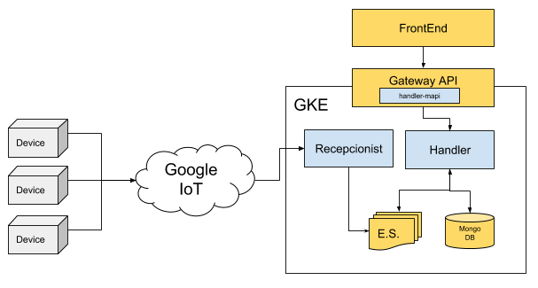

# Devices MicroService
The general purpose of this service is to listen, store and show the general information of devices reported by the microservice [ms-device-report](https://github.com/nebulae-tpm/ms-devices-report).
This process is handle by three subprocess:
 * device backend: listen to incoming reports from [ms-device-report](https://github.com/nebulae-tpm/ms-devices-report) throught the [PubSub](https://cloud.google.com/pubsub/docs/apis) PubSub Topic, then format and store the data in the materialized view then then publish this data to device api.  
 * device api: this service is a bridge between the backend and the frontend, this api use the [Apollo Graphql api](https://www.apollographql.com/docs/apollo-server/), here is hosted the Queries and the subscribtions consumed by the frontend.

 * device frontend: show the stored info of devices using a client-side aplication based on 
 [Angular core](https://angular.io/) as the basis of the project and [Angular material](https://material.angular.io/) as a visual framework. 

 _This MicroService is built on top of NebulaE MicroService Framework.  Please see the [FrameWork project](https://github.com/NebulaEngineering/nebulae) to understand the full concept_**.

 

 # Table of Contents
  * [Project Structure](#structure)
  * [FrontEnd](#frontend) - not yet available  
    *  [Environment variables](#frontend_env_vars) - not yet available  
  * [API](#api)
    * [GraphQL throught Gateway API](#api_gateway_graphql)
  * [BackEnd](#backend)
    *  [Devices](#backend_recepcionist)
        *  [Environment variables](#backend_recepcionist_env_vars)
        *  [Event Sourcing](#backend_recepcionist_eventsourcing)    
  * [Prepare development environment](#prepare_dev_env)
  * [License](#license)

# Project structure <a name="structure"></a>

```
.
├── frontend                            => Micro-FrontEnds - not yet available  
│   └── emi                             => Micro-FrontEnd for [EMI FrontEnd](https://github.com/nebulae-tpm/emi) - not yet available  
├── api                                 => Micro-APIs  
│   └── gateway                         => Micro-API for [Gateway API](https://github.com/nebulae-tpm/gateway)  
├── backend                             => Micro-BackEnds  
│   ├── devices                         => Micro-BackEnd responsible for store and publish device info incomming from ms-device-report 
├── etc                                 => Micro-Service config Files.  
├── deployment                          => Automatic deployment strategies  
│   ├── compose                         => Docker-Compose environment for local development  
│   └── gke                             => Google Kubernetes Engine deployment file descriptors  
│   └── mapi-setup.json                 => Micro-API setup file  
├── .circleci                           => CircleCI v2. config directory
│   ├── config.yml
│   └── scripts
├── docs                                => Documentation resources  
│   └── images  
├── README.md                           => This doc
```

# API <a name="api"></a>
Exposed interfaces to send Commands and Queries by the CQRS principles.  
The MicroService exposes its interfaces as Micro-APIs that are nested on the general API. 

## GraphQL throught Gateway API <a name="api_gateway_graphql"></a>
These are the exposed GraphQL functions throught the [Gateway API](https://github.com/nebulae-tpm/gateway). 

Note: You may find the GraphQL schema [here](api/gateway/graphql/devices/schema.gql)

### Queries

#### getDeviceDetail
Get device detail filtered by the device id

#### getDevices
Get a list of devices limited by page and count and filtered by a filter Template

#### getDeviceTableSize
Get the size of table Device

#### getAlarmTableSize
Get the size of table Alarms

#### getDeviceAlarms
Get a list of device alarms limited by page and count and filtered by device id, alarmType, initTime and endTime

#### getRamAvgInRangeOfTime
Get the device RAM history 

#### getRamAvgInRangeOfTime
Get the device SD history 

#### getRamAvgInRangeOfTime
Get the device CPU history 

#### getRamAvgInRangeOfTime
Get the device VOLTAGE history 

### Subscriptions

#### DeviceVolumesStateReportedEvent
Listen the changes when ms-device-report send DeviceVolumesStateReported

#### DeviceDisplayStateReportedEvent
Listen the changes when ms-device-report send DeviceDisplayStateReported

#### DeviceSystemStateReportedEvent
Listen the changes when ms-device-report send DeviceSystemStateReported

#### DeviceDeviceStateReportedEvent
Listen the changes when ms-device-report send DeviceDeviceStateReported

#### DeviceLowestVoltageReportedEvent
Listen the changes when ms-device-report send DeviceLowestVoltageReported

#### DeviceHighestVoltageReported
Listen the changes when ms-device-report send DeviceHighestVoltageReported

#### DeviceNetworkStateReportedEvent
Listen the changes when ms-device-report send DeviceNetworkStateReported

#### DeviceModemStateReportedEvent
Listen the changes when ms-device-report send DeviceModemStateReported

#### DeviceMainAppStateReportedEvent
Listen the changes when ms-device-report send DeviceMainAppStateReported

#### DeviceConnectedEvent
Listen the changes when ms-device-report send DeviceConnected

#### DeviceDisconnectedEvent
Listen the changes when ms-device-report send DeviceDisconnected

#### DeviceTemperatureAlarmActivatedEvent
Listen the changes when ms-device-report send DeviceTemperatureAlarmActivated

#### DeviceTemperatureAlarmDeactivatedEvent
Listen the changes when ms-device-report send DeviceTemperatureAlarmDeactivated